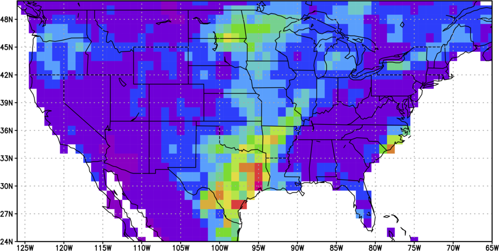
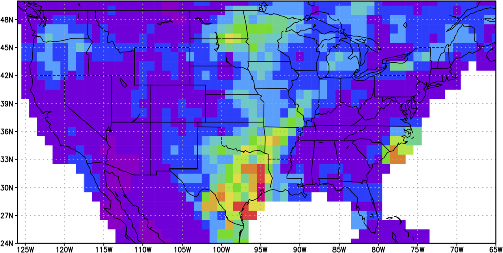

Geospatial Grids (Geogrids)
===========================

What is a Geogrid?
------------------

The purpose of this package is to create and manipulate Geogrid objects. A Geogrid object stores
information about a geospatial grid, such as the resolution, lat/lon values of each grid point, etc.

Geogrids make it easier to work with geospatial data in Python. While there are many [existing geospatial Python packages](https://github.com/SpatialPython/spatial_python/blob/master/packages.md), I wanted to make a very simple one that would allow me to work with the same grids across different applications. Here at CPC, and many other places, we use the same set of grids everywhere (1-degree global, 0.5-degree global, etc.). Why not define that grid once and be done with it?

Geogrids are utilized by several other CPC packages, including the [GeoPlot](../cpc.geoplot) package.

How do I create a Geogrid?
--------------------------

Geogrids can be created in one of 2 ways, by name (referencing one of several built-in Geogrids), or by creating a custom Geogrid.

### Using a built-in grid

Built-in grids include:

- 1deg-global
- 2deg-global
- 2.5deg-global
- 2deg-conus
- 1/6th-deg-global
- 0.5-deg-global-center-aligned
- 0.5deg-global-edge-aligned

For a list of all built-in Geogrids, call the `list_builtin_geogrids()` function:

```python
>>> from cpc.geogrids import list_builtin_geogrids
>>> list_builtin_geogrids()
['2.5deg-global',
 '1/6th-deg-global',
 '2deg-conus',
 '0.5-deg-global-center-aligned',
 '0.5-deg-global-edge-aligned',
 '2deg-global',
 '1deg-global']
```

You can create a Geogrid using a built-in definition like this:

```python
>>> from cpc.geogrids import Geogrid
>>> grid = Geogrid('1deg-global')
>>> grid
Geogrid:
- lats: [-90.0, -89.0,....0, 88.0, 89.0, 90.0]
- ll_corner: (-90, 0)
- lons: [0.0, 1.0, 2.0... 357.0, 358.0, 359.0]
- name: 1deg-global
- num_x: 360
- num_y: 181
- res: 1
- type: latlon
- ur_corner: (90, 359)
```

### Creating a custom grid

You can create a custom grid by passing the following arguments when instantiating the Geogrid:

- `ll_corner` - lower-left corner of the grid, formatted as (lat, lon)
- `ur_corner` - upper-right corner of the grid, formatted as (lat, lon)
- `res` - resolution of the grid (in km if `type="even"`, in degrees if `type="latlon"`)
- `type` - grid type ('latlon' [default] or 'equal')

For example:

```python
>>> from cpc.geogrids import Geogrid
>>> grid = Geogrid(ll_corner=(20, 30), ur_corner=(60, 90), res=2)
>>> grid
Geogrid:
- lats: [20.0, 22.0, 2....0, 56.0, 58.0, 60.0]
- ll_corner: (20, 30)
- lons: [30.0, 32.0, 3....0, 86.0, 88.0, 90.0]
- name: custom
- num_x: 31
- num_y: 21
- res: 2
- type: latlon
- ur_corner: (60, 90)
```

How do I manipulate data on Geogrids?
-------------------------------------

The `cpc.geogrids` packages comes with several functions to manipulate data residing on Geogrids, such as interpolating between Geogrids, smoothing Geogrids, and filling in data points near the border of a mask (eg. coastal values). These functions are documented below.

### Interpolating data

The `interpolate()` function can interpolate an array of data from one Geogrid to another. For example, to interpolate between a 1- and 2-degree global Geogrid:

```python
>>> import numpy as np
>>> from cpc.geogrids import Geogrid
>>> from cpc.geogrids.manipulation import interpolate
>>> old_grid = Geogrid('1deg-global')
>>> new_grid = Geogrid('2deg-global')
>>> old_data = np.fromfile('example.bin', 'float32').reshape(old_grid.num_y, old_grid.num_x)
>>> new_data = interpolate(old_data, old_grid, new_grid)
>>> old_data.shape
(181, 360)
>>> new_data.shape
(91, 180)
```

See the [API documentation](api/manipulation/#functions) for more information.

### Smoothing data

The `smooth()` function can spatially smooth data on a Geogrid. For example:

```python
>>> import numpy as np
>>> from cpc.geogrids import Geogrid
>>> from cpc.geogrids.manipulation import smooth
>>> grid = Geogrid('1deg-global')
>>> A = np.fromfile('example.bin', 'float32').reshape(grid.num_y, grid.num_x)
>>> B = smooth(A, grid, factor=2)
```

Here are examples of mean temperature observations with different smoothing factors:

| Unsmoothed      | Smoothing Factor 1.0 | Smoothing Factor 3.0 |
|:---------------:|:--------------------:|:--------------------:|
| ![][unsmoothed] |  ![][smoothed-1.0]   |   ![][smoothed-3.0]  |

[unsmoothed]: images/example-smoothing-unsmoothed.png
[smoothed-1.0]: images/example-smoothing-1.0.png
[smoothed-3.0]: images/example-smoothing-3.0.png

See the [API documentation](api/manipulation/#functions) for more information.

### Filling in coastal values

When you're working with a course dataset (eg. 1-degree global or greater), and your dataset is land-only, you may get some missing coastal areas. For example, here are 1-degree gridded precipitation observations:



As you can see, there are some coastal areas that are not covered by a grid square. Using the `fill_outside_mask_borders()` function, we can fill in 1 or more grid point layers outside the masked area (outside the land):

```python
>>> import numpy as np
>>> from cpc.geogrids.manipulation import fill_outside_mask_borders
>>> data = np.fromfile('example.bin', dtype='float32').reshape(181, 360)
>>> B = fill_outside_mask_borders(A)
```

Here are the resulting observations:



See the [API documentation](api/manipulation/#functions) for more information.

### Converting gridded data to station data

The `cpc.geogrids.manipulation.grid_to_stn()` function returns a list of data values at stations. You supply the function with the gridded data, the `Geogrid` the gridded data applies to, and a list of station latitudes and longitudes. For example:

```python
>>> import numpy as np
>>> from cpc.geogrids.manipulation import grid_to_stn
>>> from cpc.geogrids import Geogrid
>>> geogrid = Geogrid('1deg-global')
>>> stn_lats = [30, 40, 50]
>>> stn_lons = [200, 210, 220]
>>> gridded_data = np.fromfile('/path/to/500hgt_05d_20120515.bin', 'float32')
>>> grid_to_stn(gridded_data, geogrid, stn_lats, stn_lons)
[5789.7549, 5612.4351, 5558.7021]
```

*Note that the function currently simply picks the closest grid point as the station value, as opposed to doing linear interpolation.*

A basic station list is included as a resource in this package. You can access it like this:

```python
from pkg_resources import resource_filename
stn_file = resource_filename('cpc.geogrids', 'data/station-list-tmean.csv')
with open(stn_file, 'r') as file:
    for line in file:
        # Process each line of the CSV file
```

Here's a full example of parsing the station list into station latitudes and longitudes:

```python
>>> from pkg_resources import resource_filename
>>> stn_file = resource_filename('cpc.geogrids', 'data/station-list-tmean.csv')
>>> with open(stn_file, 'r') as file:
>>>     # Skip header line
>>>     next(file)
>>>     # Loop over lines
>>>     for line in file:
>>>         # Split line into columns
>>>         columns = line.replace('\n', '').split(',')
>>>         # Append id, lat, and lon to lists
>>>         stn_ids.append(columns[0])
>>>         stn_lats.append(float(columns[6]))
>>>         if float(columns[7]) < 0:  # convert to positive lons
>>>             stn_lons.append(float(columns[7]) + 360)
>>>         else:
>>>             stn_lons.append(float(columns[7]))
```

See the [API documentation](api/manipulation.html) for more information.

Other things you can do with a Geogrid
--------------------------------------

### Check that a data array fits a Geogrid

If you have defined a Geogrid, and you want to see if a given array of data fits that particular Geogrid, you can use the `Geogrid.data_fits()` function. For example:

```python
>>> import numpy as np
>>> from cpc.geogrids import Geogrid
>>> grid = Geogrid('1deg-global')
>>> data = np.random.random((grid.num_y, grid.num_x))
>>> data.shape
(181, 360)
>>> grid.data_fits(data)
True
>>> data = np.random.random((grid.num_y + 1, grid.num_x + 1))
>>> data.shape
(182, 361)
>>> grid.data_fits(data)
False
```

See the [API documentation](api/definition/#cpcgeogridsdefinitiongeogrid-objects) for more information.

### Get the index of a grid point at a given lat/lon

If you have a 1-dimensional array of data corresponding to a given Geogrid, and you want to know the index of a grid point at a given latitude and longitude, the `latlon_to_1d_index()` function will give you that index.

For example, you may have a 1-dimensional data array on a `1deg-global` Geogrid, and you want to know the index corresponding to 50 deg lat, -80 deg lon:

```python
>>> from cpc.geogrids import Geogrid
>>> grid = Geogrid('1deg-global')
>>> grid.latlon_to_1d_index((50, -80))
[50820]
```

See the [API documentation](#NEED-LINK-HERE) for more information.
